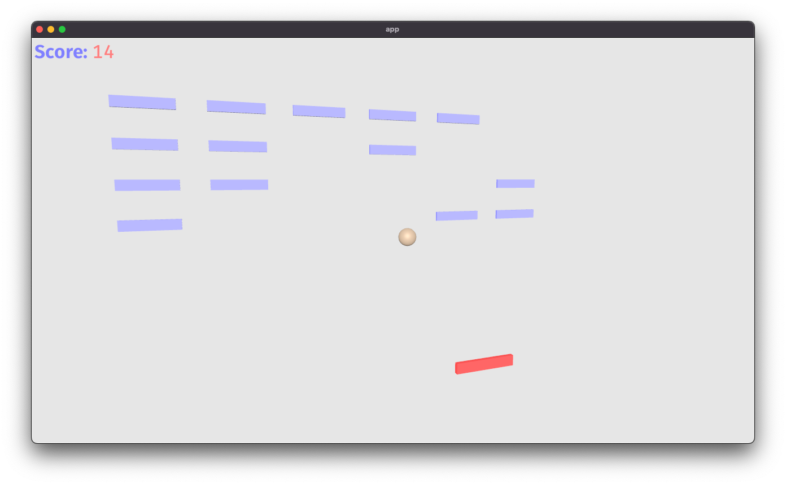

# 3D Breakout for Bevy

Based off the 2D example from [Bevy examples](https://github.com/bevyengine/bevy/blob/51aab032edcb2e97befe19ea985d35758c5e7e6d/examples/games/breakout.rs)

## Status

Mostly done, but likely not using best practices

Based on Bevy Version 0.9

# License

This project is licensed under the [MIT license](https://github.com/aevyrie/bevy_mod_bounding/blob/master/LICENSE).

## Credit

Uses shaders from Bevy Examples